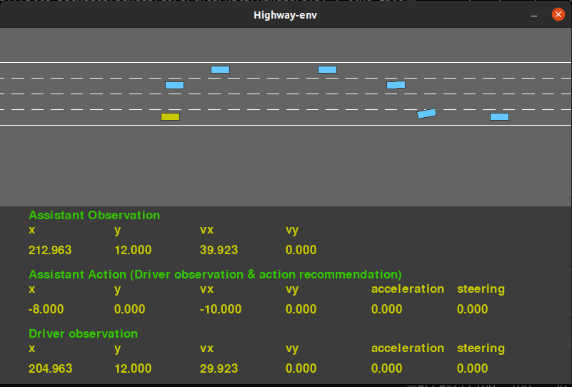

.. _driver_assistant:

Driver-Assistant
================

The `Driver-Assistant` environment builds on top of the existing `Highway-Env <https://github.com/eleurent/highway-env>`_ environment :cite:p:`highway-env` and involves a driver agent controlling a car as it navigates a busy highway. At the same time the assistant agent receives sensor readings about the vehicles state and can modify the observation the driver agent receives about the vehicle. Furthermore, the assistant can provide a recommended action for the driver. Both agents receive a common reward which incentivizes safe fast driving.




   The `Driver-Assistant` environment GUI.


Similarly to the `Exercise-Assistant` environment the `Driver-Assistant` environment involves both asymmetric information and asymmetric control. The Assistant has perfect knowledge of the current state of the vehicle, i.e. via direct access to sensors, and controls the observations the driver recieves. Meanwhile, the driver has full direct control over the vehicle and it's state, while the assistant can only influence the state via the signals it sends to the driver. This creates an interesting dynamic which depends a lot on how much the driver trusts the assistant. The assistant needs to learn how the driver reacts to its observations as well as how much of an influence the assistants recommendations have on the driver’s action. Based on the driver’s policy the assistant may choose to adjust the observations it communicates to the driver or report accurate observations.


Environment Versions
~~~~~~~~~~~~~~~~~~~~

There are multiple versions of the `Driver-Assistant` environment with each one differing based on the action type of the assistant and the policy of the driver. Specifically, the list of gym registered environments includes:

1. ``DriverAssistant-v0`` = full multi-agent, discrete driver and assistant actions
2. ``DriverAssistantContinuous-v0`` = full multi-agent, continuous driver and assistant actions
3. ``DriverAssistantHD-v0`` = Human Driver model policy (with parameters re-sampled at the start of each episode), discrete assistant actions
4. ``DriverAssistantContinuousHD-v0`` = Human driver model policy (with parameters re-sampled at the start of each episode), continuous assistant actions
5. ``DriverAssistantOD-v0`` = Obedient driver model policy, discrete assistant actions
6. ``DriverAssistantContinuousOD-v0`` = Obedient driver model policy, continuous assistant actions
7. ``DriverAssistantIA-v0`` = Independent driver model policy, discrete assistant actions
8. ``DriverAssistantContinuousIA-v0`` = Independent driver model policy, continuous assistant actions


Driver Models
~~~~~~~~~~~~~

IDM + Mobil 'Human' Driver Model
````````````````````````````````

The `Driver-Assistant` environment comes with realistic driver policy that can be used to test Assistant agents. Specifically, it makes use of the behaviour models that come with the Highway environment which implement the Intelligent Driver Model (IDM) :cite:p:`Treiber2000` for acceleration and steering control and the Minimizing Overall Braking Induced by Lane change (MOBIL) model :cite:p:`Kesting2007` for lane changing. This IDM+MOBIL driver policy is controlled by a number of parameters which make it possible to produce a range of driver behaviours, such as aggressive or defensive driving.

Similarly to the `Exercise-Assistant` environment it is possible to fix the driver policy in the environment or have the driver parameters randomly changed for each episode.


Obedient Athlete Model
``````````````````````

This is the same as the `Human Driver Model` except that the `independence` parameter (`i`) is set to **0**, so that the driver always performs the action recommended by the assistant.

This policy is useful for testing that the assistant can learn a good policy for the environment independent of having to reason about how the driver will react to the assistants signals.


Independent Driver Model
````````````````````````

This is the same as the `Human Driver Model` except that the `independence` parameter (`i`) is set to **1**, so that the driver always performs the action they believe is best based in their model. Notice though that the Assistant can still influence the driver's decision based on the observation they provide to the driver.

This policy is useful for testing whether the assistant can learn to decieve the driver into making the best decisions. The assistant can be deceptive (or not) via the observations about the driver's vehicle that it provides to the driver.


State Space
~~~~~~~~~~~

The state of the environment includes the position and velocity of the driver's vehicle and all other vehicles on the road. For more in-depth descriptions of the state and dynamics we refer the reader to the `highway-env documentation <https://highway-env.readthedocs.io/en/latest/index.html>`_.


Driver Properties
~~~~~~~~~~~~~~~~~

The driver controls the `steering` and `acceleration` of the vehicle and observes the position and velocity of the driver's vehicle and a set number of neighbouring vehicles.


Discrete Driver Action Space
````````````````````````````

The discrete driver action space is made up of two distinct discrete action spaces. The first relates to `acceleration` and the second to `steering`.

**Action Space Type:** ``MultiDiscrete([3, 3])``

.. list-table:: Discrete Driver Action Space
   :widths: 25 50 50
   :header-rows: 1

   * - Action Num
     - Acceleration Action
     - Steering Action
   * - 0
     - ACCELERATE
     - LEFT
   * - 1
     - NOCHANGE
     - STRAIGHT
   * - 2
     - BRAKE
     - RIGHT


Continuous Driver Action Space
``````````````````````````````

The continuous driver action space allows the agent to directly set the low-level controls of the vehicle kinematics for the `acceleration` and `steering` angle. The space is defined as a ``Box(2)``.

**Action Space Type:** ``Box(2)``

.. list-table:: Continuous Driver Action Space
   :widths: 25 50 15 15
   :header-rows: 1

   * - Feature Num
     - Action Feature
     - Min
     - Max
   * - 0
     - Acceleration
     - -1.0
     - 1.0
   * - 1
     - Steering
     - -1.0
     - 1.0


Driver Observation Space
````````````````````````

We use the `highway-env` `Kinematics observation <https://highway-env.readthedocs.io/en/latest/observations/index.html#kinematics>`_  for the driver with some modifications in order to incorporate the assistant. Each observation is a `V x F` grid, where each row represents the `F` feature observations of the the ego vehicle as well as the `V-1` closest vehicles, with the first row always the observation of the ego vehicle.

The features are the `x` and `y` position and the velocity in the x-dimenstion `vx` and y-dimension `vy`. Also included is a `presence` flag, which is ``1`` to indicate the presence of a nearby vehicle, or ``0`` if the row does not include and a vehicle observation. This is required since the driver observes only vehicles within some range so it is possible to have observation rows of all ``0`` due to there being no nearby vehicle or due to the observed vehicle having values of ``0`` for all features. Finally, the observation also includes the assistant's `acceleration recommendation` and `steering recommendation`, which are ``0`` for all rows except the ego vehicle row.

Note that the observations for the ego vehicle are provided to the driver by the assistant (i.e. via the vehicle dashboard display), while the observations of the other vehicles are the driver's own observation (unmodified by the assistant).

All observations are normalized to the range [-1.0, 1.0] by default.


**Observation Space Type:** ``Box((V, 7))``

Where, `V` is the number of nearby vehicles observed (``default=5``) and ``7`` is the number of observation features `F`.


.. list-table:: Driver Observation Space
   :widths: 25 50 15 15
   :header-rows: 1

   * - Feature Num
     - Feature
     - Min
     - Max
   * - 0
     - `presence`
     - 0.0
     - 1.0
   * - 1
     - `x`
     - -1.0
     - 1.0
   * - 2
     - `y`
     - -1.0
     - 1.0
   * - 3
     - `vx`
     - -1.0
     - 1.0
   * - 4
     - `vy`
     - -1.0
     - 1.0
   * - 5
     - `acceleration recommendation`
     - -1.0
     - 1.0
   * - 6
     - `steering recommendation`
     - -1.0
     - 1.0


Assistant Properties
~~~~~~~~~~~~~~~~~~~~

The assistant observes the current position and velocity of the ego vehicle and the `V` nearby vehicles. It then provides an observation of the ego vehicle to the driver along with recommendations for `acceleration` and `steering` actions.


Continuous Assistant Action Space
`````````````````````````````````

This includes continuous actions for the assistant signal sent to the driver which includes: [`x`, `y`, `vx`, `vy`] of the vehicle, along with the recommended `acceleration` and `steering` action. It also includes assistant recommendation for the drivers next action in terms of throttle and steering. The action space actions are always in the interval [-1, 1], but mapped to the proper values in the environment step function, as needed.


**Action Space Type:** ``Box(6)``

.. list-table:: Continuous Assistant Action Space
   :widths: 25 50 15 15
   :header-rows: 1

   * - Feature Num
     - Action Feature
     - Min
     - Max
   * - 0
     - `x`
     - -1.0
     - 1.0
   * - 1
     - `y`
     - -1.0
     - 1.0
   * - 2
     - `vx`
     - -1.0
     - 1.0
   * - 3
     - `vy`
     - -1.0
     - 1.0
   * - 4
     - `acceleration`
     - -1.0
     - 1.0
   * - 5
     - `steering`
     - -1.0
     - 1.0


Discrete Assistant Action Space
```````````````````````````````

This is a MultiDiscrete Action space, where each action is a combination of 6 sub actions, similar to the continuous Assistant actions:

**Action Space Type:** ``MultiDiscrete([3, 3, 3, 3, 3, 3])``

.. list-table:: Discrete Assistant Action Space
   :widths: 15 50 50 50 50 50 50
   :header-rows: 1

   * - Num
     - `x` mod
     - `y` mod
     - `vx` mod
     - `vy` mod
     - `acceleration`
     - `steering`
   * - 0
     - NOOP
     - NOOP
     - NOOP
     - NOOP
     - NOOP
     - NOOP
   * - 1
     - UP
     - UP
     - UP
     - UP
     - ACCELERATE
     - LEFT
   * - 2
     - DOWN
     - DOWN
     - DOWN
     - DOWN
     - BRAKE
     - RIGHT


For the [`x`, `y`, `vx`, `vy`] action space actions have the effect of shifting the current offset/distortion being applied to the observation by a fixed amount depending on the feature (see the ``bdgym.envs.driver_assistant.action.AssistantDiscreteActionSpace.STEP_SIZE_MAP`` for exact values).

The `acceleration` and `steering` action space actions have the effect of recommending to the driver to steer and/or accelerate up, down, or no change for the step the action is applied.

**NOTE**: Using this action space affects the observation space of the assistant. Specifically, it adds an extra row at the top of the observation matrix which is the current offset.


Continuous Assistant Observation Space
``````````````````````````````````````

The assistant's observation when using continuous actions is exactly the `highway-env` `Kinematics observation <https://highway-env.readthedocs.io/en/latest/observations/index.html#kinematics>`_.

All observations are normalized to the range [-1.0, 1.0] by default.

**Observation Space Type:** ``Box((V, 5))``

Where, `V` is the number of nearby vehicles observed (``default=5``) and ``5`` is the number of observation features `F`.


.. list-table:: Continuous Assistant Observation Space
   :widths: 25 50 15 15
   :header-rows: 1

   * - Feature Num
     - Feature
     - Min
     - Max
   * - 0
     - `presence`
     - 0.0
     - 1.0
   * - 1
     - `x`
     - -1.0
     - 1.0
   * - 2
     - `y`
     - -1.0
     - 1.0
   * - 3
     - `vx`
     - -1.0
     - 1.0
   * - 4
     - `vy`
     - -1.0
     - 1.0


Discrete Assistant Observation Space
````````````````````````````````````

When the assistant is using the discrete action space the assistant's observation space is the same as in `Continous Assistant Observation Space` with the addition of an extra row, at the top of the observation matrix, which contains the current modification being applied to the driver's observation.

This extra row is exactly the same as all the other rows, containing observations of the [`presence`, `x`, `y`, `vx`, `vy`] features (noting the `presence` feature always has a value of ``0``).


Transition
~~~~~~~~~~

Refer to the `highway-env dynamics <https://highway-env.readthedocs.io/en/latest/dynamics/index.html>`_ documentation for details on the state transition dynamics, including details of how the other vehicles in the environment behave.


Reward
~~~~~~

The reward is the same as the `highway-env rewards <https://highway-env.readthedocs.io/en/latest/rewards/index.html>`_, except the incentives for being in the right-hand lane and going at a high speed are increased.


Termination
~~~~~~~~~~~

The episode terminates if the ego vehicle goes off the road or crashes into another vehicle, or after a finite number of steps.
