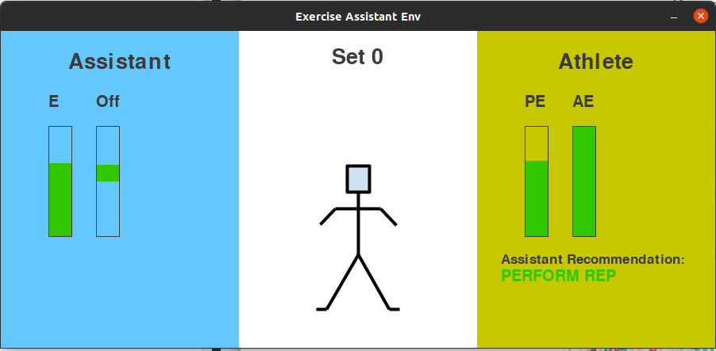

.. _exercise_assistant:

Exercise Assistant
==================

The `Exercise-Assistant` environment simulates a human-in-the-loop scenario involving a human athlete performing an exercise under the guidance of a robot assistant. Both share the common goal of the athlete completing as many repetitions of an exercise without the athlete over-exerting themselves. A real-world example of this scenario is a patient undergoing physiotherapy under the watch of a robot or system that monitors their form.



   The `Exercise-Assistant` environment GUI.


The environment is episodic with a single episode involving the athlete performing a fixed number of sets of the exercise. The state of the environment is simply the current set number and the amount of energy the athlete has remaining. Each step of the environment evolves as follows:

1. The assistant observes the athletes energy level and last action (except for in the initial step) and sends their signal to the athlete which includes communicating how much energy the athlete has remaining and also the assistants recommendation (i.e. perform a repetition or end the set).
2. The athlete then receives the assistants signal along with a noisy observation of their current energy level and selects whether they will perform another repetition or end the set.

Each time the athlete performs a repetition they lose some random amount of energy sampled from a fixed distribution and both agents gain a fixed reward, e.g. 1.0. If they perform too many repetitions they become over-exerted and the episode ends and both agents receive a negative reward, e.g. -1.0. If the athlete chooses to end the set then the number of sets increases and the athlete recovers a random amount of energy sampled from a fixed distribution, to replicate the effect of the athlete resting between sets. Ending a set provided no reward. The episode ends after all sets are complete or the athlete becomes over-exerted.

This environment involves both asymmetric information and asymmetric control. The Assistant has perfect knowledge of the current state, i.e. via access to advanced sensors, while the athlete has only noisy observations of the current state. Meanwhile, the athlete has full direct control over the state of the environment, while the assistant can only influence the state via the signals it sends to the athlete. This creates an interesting dynamic which depends a lot on how much the athlete trusts their percieved energy level versus the assistant's signal and recommendation. It replicates the challenge of an AI assistant being able to decipher the mental model of the athlete so it can either gain the trust of the athlete or deceive them in a way such that the optimal number of reps are performed, for example by reporting they have much less or more energy than they do in reality.


Environment Versions
~~~~~~~~~~~~~~~~~~~~

There are multiple versions of the `Exercise-Assistant` environment with each one differing based on the action type of the assistant and the policy of the athlete. Specifically, the list of gym registered environments includes:

1. ``ExerciseAssistant-v0`` = full multi-agent, discrete athlete and assistant actions
2. ``ExerciseAssistantContinuous-v0`` = full multi-agent, discrete athlete actions, continuous assistant actions
3. ``ExerciseAssistantHA-v0`` = Human Athlete model policy (with parameters re-sampled at the start of each episode), discrete assistant actions
4. ``ExerciseAssistantContinuousHA-v0`` = Human athlete model policy (with parameters re-sampled at the start of each episode), continuous assistant actions
5. ``ExerciseAssistantOA-v0`` = Obedient Athlete model policy, discrete assistant actions
6. ``ExerciseAssistantContinuousOA-v0`` = Obedient athlete model policy, continuous assistant actions
7. ``ExerciseAssistantIA-v0`` = Independent Athlete model policy, discrete assistant actions
8. ``ExerciseAssistantContinuousIA-v0`` = Independent athlete model policy, continuous assistant actions


Athlete Models
~~~~~~~~~~~~~~

Human Athlete Model
```````````````````

The `Exercise-Assistant` environment also includes a parameterized athlete policy designed to simulate a human athlete. This policy factors in how much the athlete considers the energy signal and action recommendation recieved from the assistant, as well as the athlete's willingness to push closer to being fatigued. The policy is deterministic and parameterized with three parameters: `threshold (t)`, `perception influence (p)`, and `independence (i)`. The policy decides whether the athlete will perform a rep or end the set over a number of steps.

Firstly, the athlete determines what they belief their energy level (`BE`) is based on their perceived energy (`PE`) and the energy level reported by assistant (`AE`) as::

  DE = (1-p)*PE + p*AE


Then, the athlete's personal action decision (`BA`) is determined as follows::

  BA = Perform Rep if DE > t, otherwise End Set


Note, that the athlete action is represented as an integer with the perform repetition action represented as a `0` andthe end set action represented as a `1`. So `BA` will have a value of `0` or `1`

Finally, the action actually performed by the athlete (`A`) factors in the assistant's recommendation (`R`), which is similarly represented as an integer 0, or 1::

  A = End Set if (i*BA + (1-i)*R) > 0.5, otherwise Perform Rep


Noting that although `BA` and `R` can be either 0 or 1, the value for the `independence` parameter `i` is a probability, hence why we set the threshold at `0.5`.

Users of the environment can select a fixed athlete model to train and test agents against or they can select to have new parameters (`t`, `p`, and `i`) for the athlete sampled anew each episode. The most challenging and interesting environment is where the athlete parameters are re-sampled each episode as this requires the assistant to be able to learn to adapt to different athlete behaviours or learn a policy that is robust to different athletes.


Obedient Athlete Model
``````````````````````

This is the same as the `Human Athlete Model` except that the `independence` parameter (`i`) is set to **0**, so that the athlete always performs the action recommended by the assistant.

This policy is useful for testing that the assistant can learn a good policy for the environment independent of having to reason about how the athlete will react to the assistants signals.


Independent Athlete Model
`````````````````````````

This is the same as the `Human Athlete Model` except that the `independence` parameter (`i`) is set to **1**, so that the athlete always performs the action they believe is best (i.e. `BA`). Notice though that the Assistant can still influence the athlete's decision based on the energy level they report to the athlete (i.e. `AE`).

This policy is useful for testing whether the assistant can learn to decieve the athlete into making the best decisions. The assistant can be deceptive (or not) via the energy level it communicates to the athlete.


State Space
~~~~~~~~~~~

The environment state space is continous and is made up of:

- **Athlete Energy Level**: float in [0.0, 1.0]
    - The proportion of energy the athlete has remaining, if this reaches 0.0, the athlete is overexerted.
- **Sets Completed**: int in [0, MAX_SETS]
    - The number of sets completed.


Where `MAX_SETS` is 20 by default.


Starting State
``````````````

**Athlete Energy Level** = uniform from [0.75, 1.0]
**Sets Completed** = 0

I.e. the athlete starts with energy level sampled uniformly at random from [0.75, 1.0]


Athlete Properties
~~~~~~~~~~~~~~~~~~

The athlete has the same action and observation spaces for all versions of the `Exercise-Assistant` environment.


Athlete Action Space
````````````````````

The athlete has a discrete action space with 2 possible actions (i.e. ``Discrete(2)``).


.. list-table:: Athlete Action Space
   :widths: 25 25
   :header-rows: 1

   * - Action Num
     - Action
   * - 0
     - PERFORM REP
   * - 1
     - END SET


Athlete Observation Space
`````````````````````````

The athlete recieves a ``continuous`` observation with 4 features (i.e. ``Box(4)``).

.. list-table:: Athlete Observation Space
   :widths: 25 50 15 15
   :header-rows: 1

   * - Feature Num
     - Feature
     - Min
     - Max
   * - 0
     - Percieved Energy Level
     - 0.0
     - 1.0
   * - 1
     - Proportion of sets complete
     - 0.0
     - 1.0
   * - 2
     - Assistant Energy Signal
     - 0.0
     - 1.0
   * - 3
     - Assistant Recommendation
     - 0.0
     - 1.0


Assistant Properties
~~~~~~~~~~~~~~~~~~~~

The assistant's action and observation spaces vary depending on the version of the `Exercise-Assistant` environment. Specifically, if the version is using `discrete` or `continuous` assistant actions (this affects both the action and observation spaces).


Continuous Assistant Action Space
`````````````````````````````````

The continuous assistant action space includes 2 features actions (i.e. ``Box(2)``). Here we report the normalized Min and Max values of each action feature. The normalized values are linearly mapped to values in [0.0, 1.0].


.. list-table:: Continuous Assistant Action Space
   :widths: 25 50 15 15
   :header-rows: 1

   * - Feature Num
     - Action Feature
     - Min
     - Max
   * - 0
     - Energy Signal
     - -1.0
     - 1.0
   * - 1
     - Recommendation
     - -1.0
     - 1.0


Continuous Assistant Observation Space
``````````````````````````````````````

The continuous assistant observation space includes 3 features (i.e. ``Box(3)``).

.. list-table:: Continuous Assistant Observation Space
   :widths: 25 50 15 15
   :header-rows: 1

   * - Feature Num
     - Feature
     - Min
     - Max
   * - 0
     - Athlete energy level
     - 0.0
     - 1.0
   * - 1
     - Proportion of sets complete
     - 0.0
     - 1.0
   * - 2
     - Last athlete action
     - 0.0
     - 1.0


Where for `Last athlete action` a value of 0.0 means athlete performed a rep, and a value of 1.0 means athlete ended set.


Discrete Assistant Action Space
```````````````````````````````

The discrete assistant action space has 6 possible actions (i.e. ``Discrete(6)``).


.. list-table:: Discrete Assistant Action Space
   :widths: 25 50
   :header-rows: 1

   * - Action Num
     - Action
   * - 0
     - Increase,PERFORM REP
   * - 1
     - No-change,PERFORM REP
   * - 2
     - Decrease,PERFORM REP
   * - 3
     - Increase,END SET
   * - 4
     - No-change,END SET
   * - 5
     - Decrease,END SET


The Discrete Assistant Action space is the joint space of the signal offset actions (`increase`, `no-change`, `decrease`) and the recommendation actions (`PERFORM REP`, `END SET`).

The signal offset actions modify how much the assistant changes the energy level signal that is reported to the athlete (from the level observed by the assistant). Each `increase` action increases the offset by ``+OFFSET_STEP`` and each `decrease` action decreases the offset by ``-OFFSET_STEP``. Initially the offset is 0.0.

For example, if ``OFFSET_STEP = 0.05`` and the assistant has used the `increase` actopm twice and no `decrease` action then the current offset would be ``+0.1``. So if the assistant observes that the athlete has ``0.65`` of their energy remaining the signal the assistant will send to the athlete is that they have ``0.65 + 0.1 = 0.75`` energy remaining.


Discrete Assistant Observation Space
````````````````````````````````````

For the discrete action assistant, the assistant has a ``continuous`` observation space with 4 features (i.e. ``Box(4)``).

.. list-table:: Discrete Assistant Observation Space (when Assistant is using discrete action space)
   :widths: 25 50 15 15
   :header-rows: 1

   * - Feature Num
     - Feature
     - Min
     - Max
   * - 0
     - Athlete energy level
     - 0.0
     - 1.0
   * - 1
     - Proportion of sets complete
     - 0.0
     - 1.0
   * - 2
     - Last athlete action
     - 0.0
     - 1.0
   * - 3
     - Current Energy Signal Offset
     - 0.0
     - 1.0

Note, energy signal offset observation is linearly mapped to [0.0, 1.0] from the full range [-1.0, 1.0]


Transition
~~~~~~~~~~

The state of the environment only changes based on the action of the athlete.

If the athlete performs the `PERFORM REP` action then the athlete's energy level is decreased by random amount sampled from exponential distribution with scale=0.05.

Otherwise if the athlete performs the `END SET` action then the number of sets completed is increased by 1 and the athletes energy level is increased by a random amount (capped at energy=1.0) drawn from an exponential distribution with scale=0.5.


Reward
~~~~~~

``1.0`` for each repettion performed, ``0.0`` for ending set, -1.0 for over-exertion (see termination below).


Termination
~~~~~~~~~~~

An episode can terminate in one of two ways. The first is if the all sets are completed, i.e. if ``Sets Completed == MAX_SETS``. The second way is if the athlete becomes over-exerted, that is if ``Athlete Energy Level <= 0.0``.
