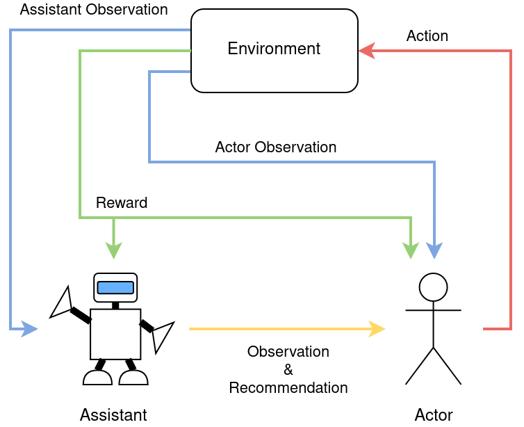

.. _actor_assistant:

The Actor-Assistant Model
=========================

In BDGym includes simulated scenarios that model human-in-the-loop systems. We modeled the chosen human-in-the-loop scenarios using an :ref:`Actor-Assistant model <actor-assistant-figure>`. The assistant agent receives accurate observations from the environment and is able to control how these observations are communicated to the actor and also provide a recommended action to the actor. Meanwhile, the actor’s observation consists of the observation from the assistant, the assistant’s recommendation, and their own observations from the environment. The actor is then responsible for deciding on the actual action performed in the environment.

.. _actor-assistant-figure:

   The `Actor-Assistant` environment model.

The key challenges in Actor-Assistant scenarios include asymmetric information and asymmetric control. For the environments we model we assume that the assistant agent’s observations of the environment are more accurate than the actor’s observations. There are many real-world scenarios where this is the case due to the AI assistant having access to more advanced sensors compared to the human actor who relies on mostly visual observations. For example, in a human-in-the-loop driving scenario the assistant is the vehicles on-board computer which receives observations directly from cameras, LIDAR, radio, etc., while the human driver receives what they can see out of their window and what is passed on by the assistant. This difference in observation accuracy and the fact that the assistant can control what the actor observes is what creates the asymmetric information. The asymmetric control stems from the actor having sole control over what action is performed in the environment.

The presence of asymmetric information and control creates the incentive for the assistant to use benevolent-deception, depending on the actor’s policy. Since the assistant receives more accurate information about the environment, they are in a position to make good action decisions. However, since the actor controls what action is actually performed they can choose to ignore any recommendations from the assistant. How much the actor takes into account the recommendation from the assistant is determined by their policy. As a real-world example a driver may choose to listen or ignore recommendedations from the assistant based on how aggressive a driver they are, how much they trust the assistant, due to poor perception of their surroundings, etc. In the situations where the actor may make sub-optimal decisions for the given state, there is an incentive for the assistant to deceive the actor, through modifying the observation they communicate to the actor, in order to indirectly control the actor's actions. The challenge for the assistant is to adjust to the actor’s policy and determine what actions to recommend and what information to provide to the actor, whether truthful or deceptive, without negatively impacting the trust between the actor and the assistant. Through the dynamics of asymmetric information and control Actor-Assistant scenarios offer a means to model Human-AI interactions in human-in-the-loop scenarios.

To make it possible to test agents in Actor-Assistant scenarios, we created two example environments: the :ref:`exercise_assistant` and :ref:`driver_assistant` environments. Both environment were inspired by real-world human-in-the-loop systems.
